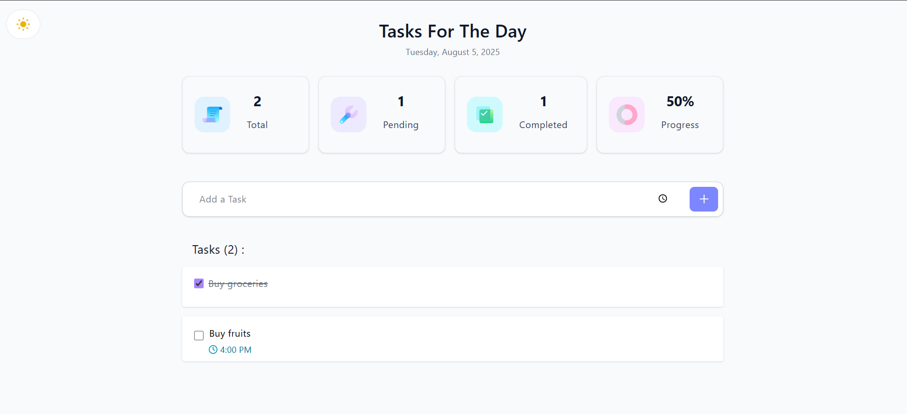

#  Luna List

Luna List is a minimal and functional to-do list web app built with **React**. Schedule tasks with a specific time, edit them anytime, and check them off when you're done — now with **dark mode** support!

---

## Features

- Add tasks with a scheduled time  
- Mark tasks as complete/incomplete  
- Edit existing tasks  
- Delete tasks  
- Dark mode toggle  
- Automatically saves tasks to local storage  

---

## Preview

Here’s a preview of the app:

  

---

## Getting Started

Follow these steps to run the project locally:

1. **Clone the repo**  
   ```bash
   git clone https://github.com/srishti0713/luna-list.git
   cd luna-list

2. **Install dependencies**
   ```bash
   npm install

3. **Start the app**
   ```bash
   npm run dev

4. **Open your browser at:**
   
   http://localhost:5173  

---

## Notes

- Currently does not support responsive design
- For best experience, use it on desktop or larger screens

---

## View Live

https://lunalist.netlify.app/


